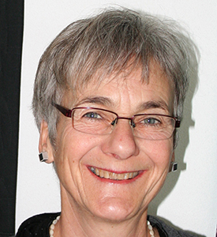

# About Me

Date of birth: December 18, 1949.
{: .fs-6 .fw-300 }
I spent my young years in Zurich, then moved to the hilly countryside of Eastern Switzerland, where I have been living since 1980.
{: .fs-6 .fw-300 }
A florist by training, I continued my education as an activation therapist. I am the mother of three adult children and a passionate gardener and cook.
{: .fs-6 .fw-300 }
My love of quilting was sparked in 2000 by the unconventional colors and designs that my friend Berti Feissli used in her quilts (at that time, she was 80).
I realized that pieced quilt making was not just about traditional patchwork patterns, but that I could design quilts in any way I wanted to. Ever since, I have worked with self-dyed cloth, textile printing techniques, and so on.
{: .fs-6 .fw-300 }
I was greatly influenced by working with Nancy Crow, Ohio (USA). To date, I have attended a total of five of Nancy’s workshops that she held in Falera (CH).
{: .fs-6 .fw-300 }
I systematically learn related techniques that I can use in making my own quilts, for example textile and screen printing (Cécile Trentini), shibori
(Heidi Hunninghaus), cloth dyeing (Heide Stoll-Weber), various stitching techniques (Judith Mundwiler), or embroidery and quilting
(Elsbeth Nusser-Lampe).
{: .fs-6 .fw-300 }