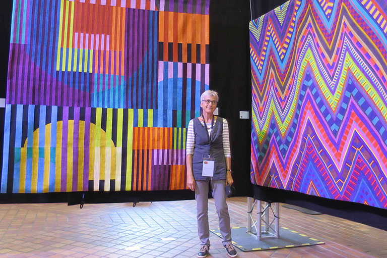

# Color Improvisations 2 in Konstanz

The exhibition Color Improvisations at the Council building took place from October 12 to 17 2017. The international exhibition displayed 50 colorful large-scale paintings. The works were created by artists from all over the world who took classes with the renowned quilt artist Nancy Crow. The exhibition was opened in a quite unconventional way: with a fashion show by Peter Hahn. The models were the artists themselves.
{: .fs-6 .fw-300 }

