# Works 2017–2019

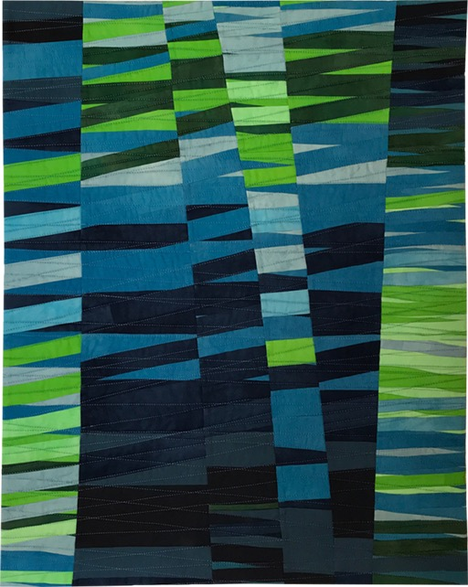

Intersections Blue / Blau (80 x 60 cm)

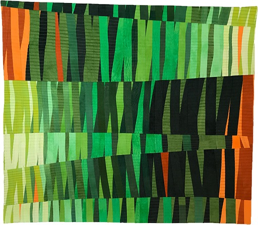

Intersections Green / Grün (84 x 95 cm)

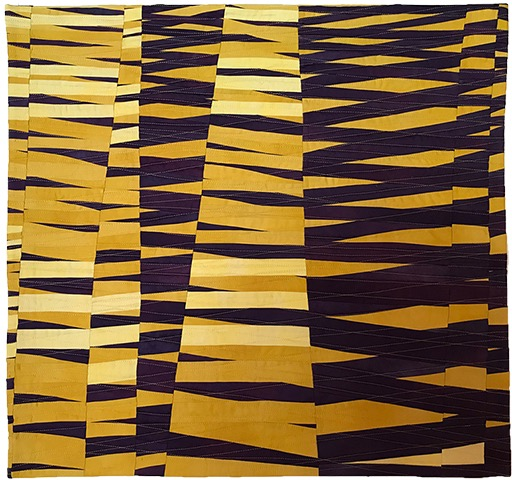

Intersections Yellow / Gelb (70 x 75 cm)

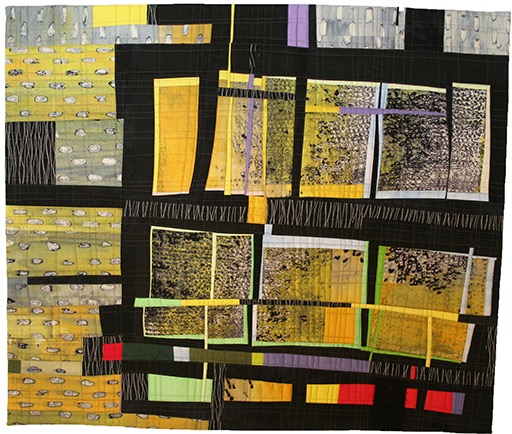

Mishmash (79 x 92 cm)

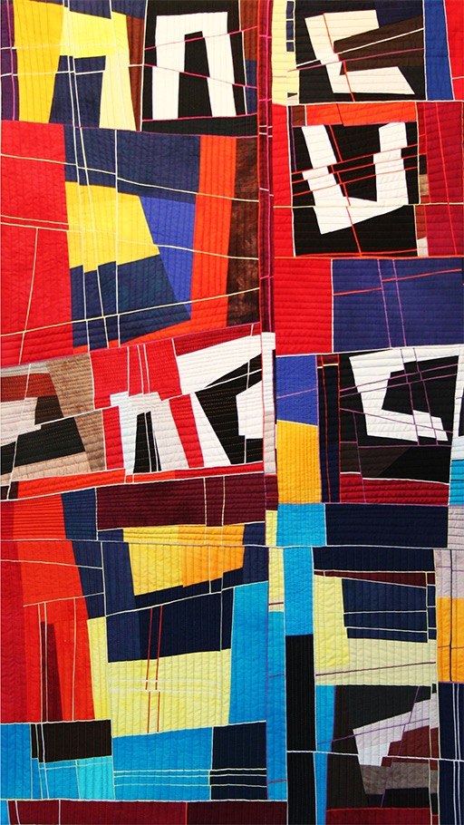

Bruchlinien (122 x 75 cm)

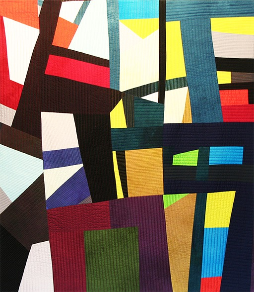

In Farbe (118 x 103 cm)

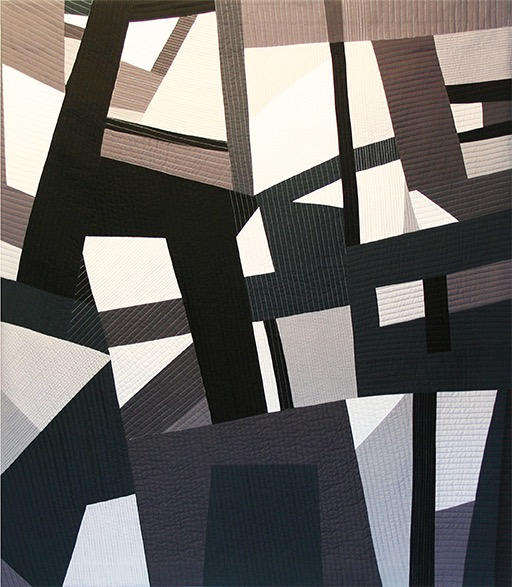

Schwarz-Grau-Weiss (130 x 115 cm)

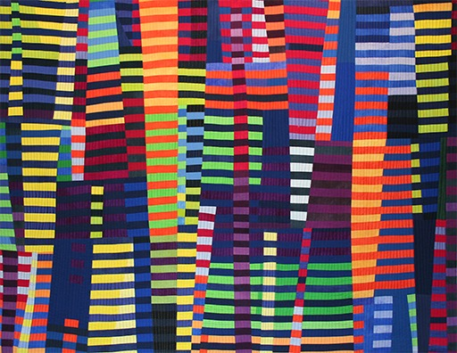

Luminoso I (122 x 156 cm)

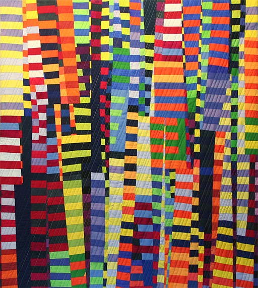

Luminoso II (103 x 93 cm)

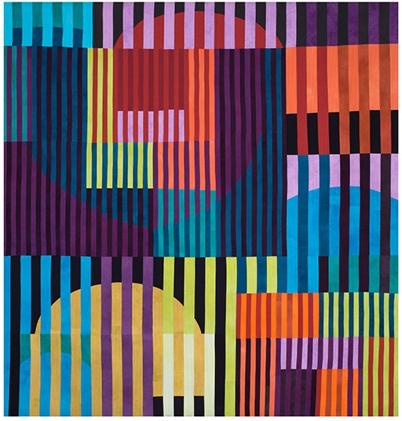

Vibrant Color Bars (218 x 207 cm)

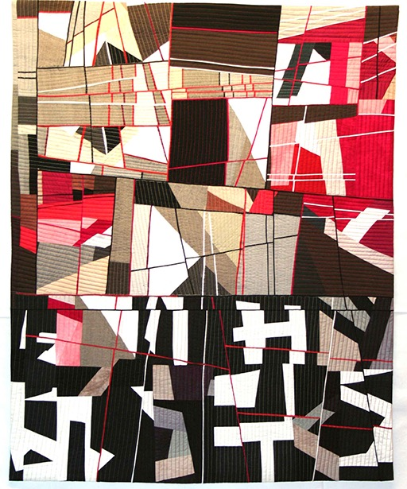

Complex Balance (100 x 80 cm)

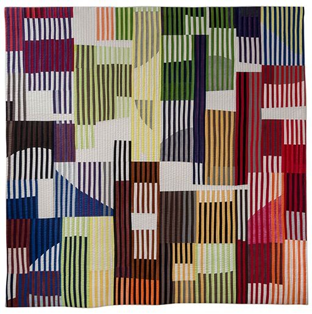

Rayas (200 x 200 cm)

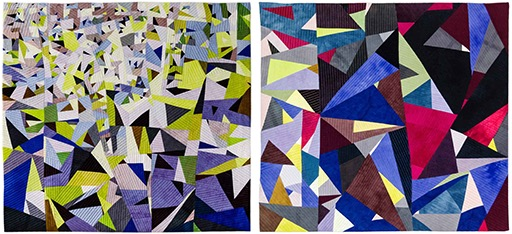

Picos (two parts, each 88 x 96 cm)
