# Works 2017–2019

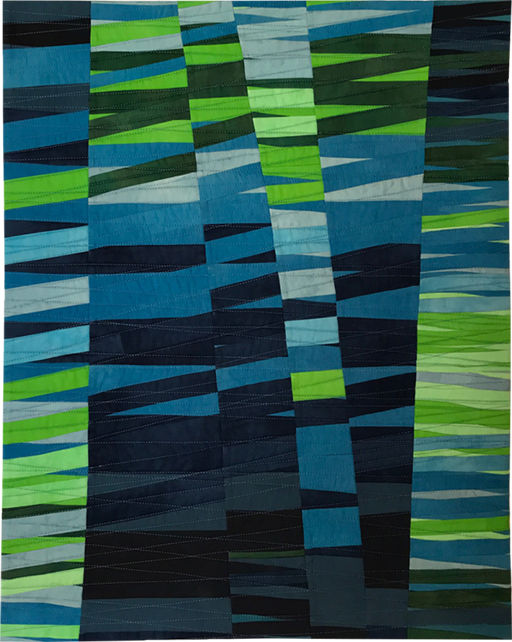

Intersections Blue / Blau

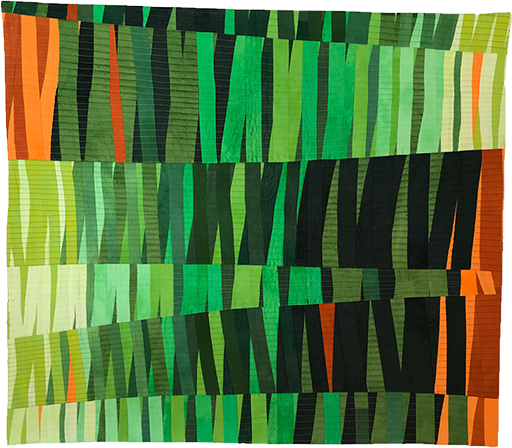

Intersections Green / Grün

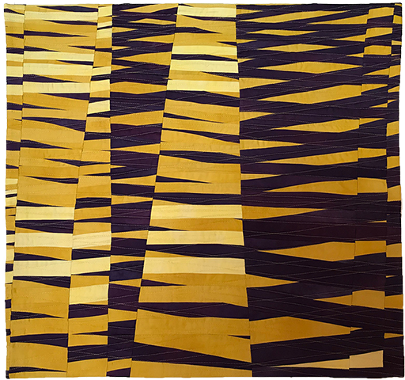

Intersections Yellow / Gelb

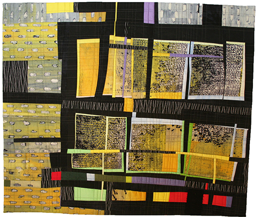

Mishmash

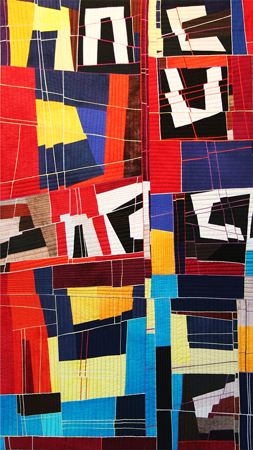

Bruchlinien

In Farbe

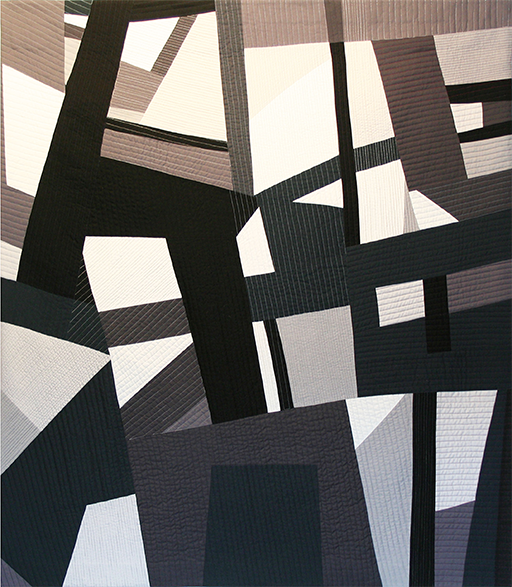

Schwarz-Grau-Weiss

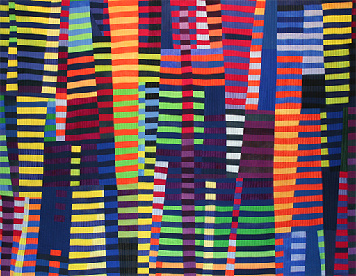

Luminoso I

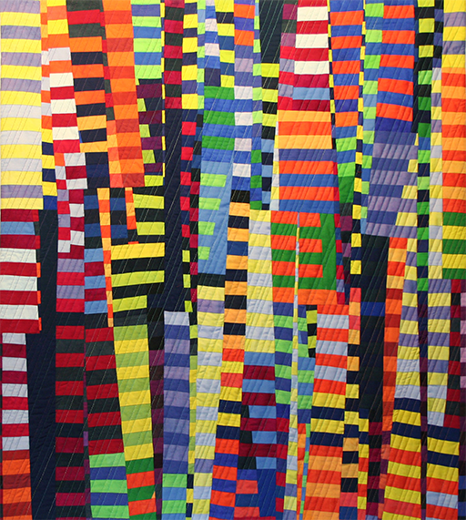

Luminoso II

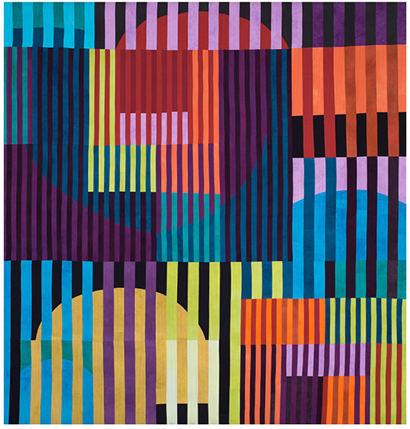

Vibrant Color Bars

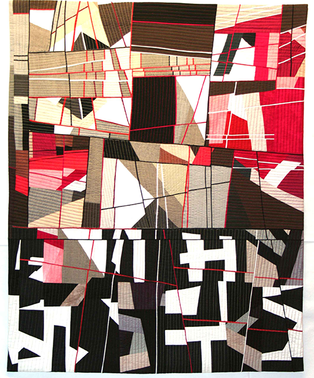

Complex Balance

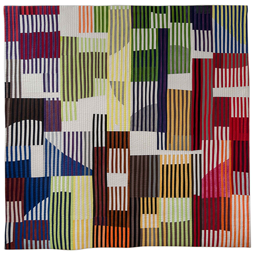

Rayas

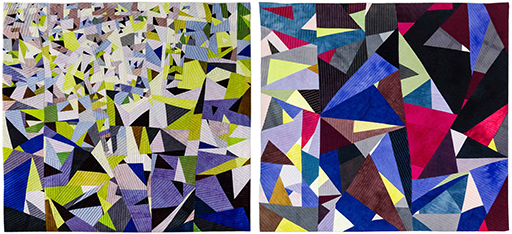

Picos (zweiteilig)