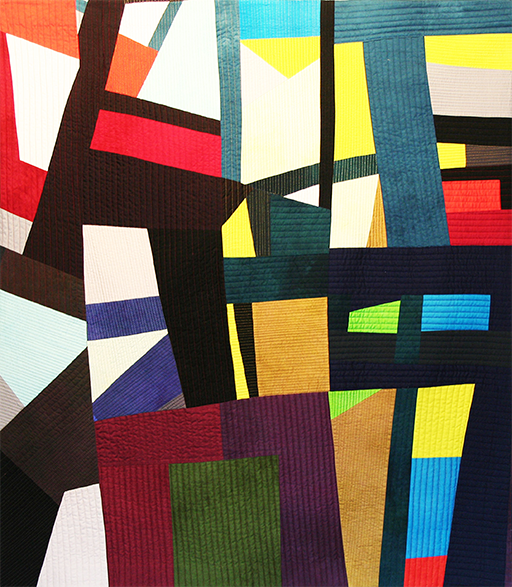

# Works 2017–2019

Intersections Blue / Blau

Intersections Green / Grün

Intersections Yellow / Gelb

Mishmash

Bruchlinien

In Farbe

Schwarz-Grau-Weiss

Luminoso I

Luminoso II

Vibrant Color Bars

Complex Balance

Rayas

Picos (zweiteilig)